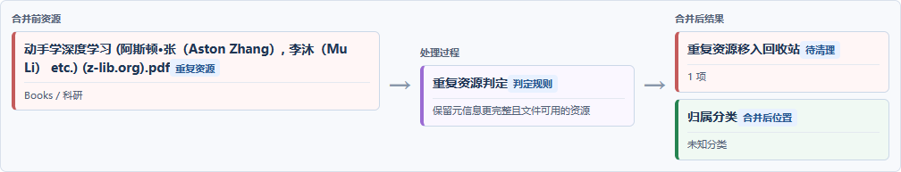
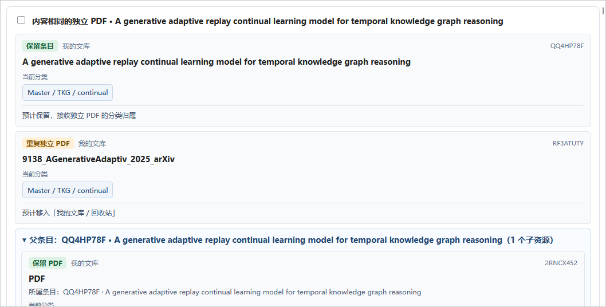

# Zotero Duplicate Cleaner

面向 Zotero 10 的文献资源整理插件，帮助你在确认后处理重复条目、重复 PDF、重复笔记、孤儿 PDF 和失效附件。

## 界面预览

## 主要功能

- 重复条目扫描：按条目类型、DOI 或完整标题发现候选，优先保留 PDF 可用且元信息更完整的条目。
- PDF 内容去重：按实际文件 SHA-256 判断，支持条目内 PDF 与独立 PDF 对照。
- 笔记去重：仅对完整 HTML 内容完全相同的笔记提出候选。
- 无效资源扫描：识别没有附件、附件文件缺失的条目及可安全处理的缺失附件记录。
- 孤儿 PDF 建父条目：先扫描展示，用户勾选后分批调用 Zotero 内置元数据识别。
- 资源流图：展示来源、判定过程、保留结果和处理去向。
- 统计概览、名称搜索、全选当前可见结果和父子资源折叠。

## 安装与使用

从 GitHub Releases 下载最新 `.xpi`，在 Zotero 中打开“工具 → 插件”，点击齿轮并选择“从文件安装插件”，安装后重启 Zotero。打开“工具 → 文献资源整理”，选择扫描类型；结果默认不勾选，核对后再选择并处理。

## 安全与隐私

插件只访问当前 Zotero 文献库，不上传文献内容。PDF 去重在本地计算文件哈希；无法读取、等待下载、URL 附件以及带批注或关联记录的资源会被跳过。删除操作只将 Zotero 记录移入回收站。

## 兼容性

支持 Zotero 10.0.1 及更高版本。

## 许可证

MIT License。作者：[Alleyf](https://github.com/Alleyf)。
